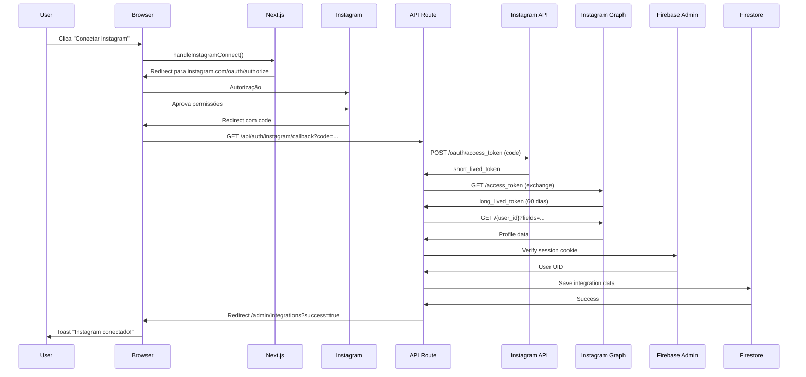

# Instagram Business Login - Configuração Completa

## ✅ Implementação Realizada

### 1. **Instagram Business OAuth Flow**
Implementado fluxo OAuth completo seguindo a documentação oficial do Meta:
- Authorization URL com novos scopes (instagram_business_*)
- Exchange de authorization code por short-lived token
- Troca automática por long-lived token (60 dias)
- Sistema de refresh automático de tokens

### 2. **Arquivos Modificados/Criados**

#### **`/src/services/meta-sdk-integration.ts`**
- ✅ Adicionadas interfaces TypeScript para OAuth
- ✅ `getInstagramAuthUrl()` - Gera URL de autorização
- ✅ `loginWithInstagramOAuth()` - Inicia fluxo OAuth
- ✅ `exchangeInstagramCodeForToken()` - Troca code por token
- ✅ `getInstagramLongLivedToken()` - Obtém long-lived token
- ✅ `refreshInstagramToken()` - Renova token expirado
- ✅ `getInstagramProfileData()` - Busca dados do perfil

#### **`/src/app/api/auth/instagram/callback/route.ts`**
API Route completa que:
1. Recebe authorization code do Instagram
2. Troca code por short-lived token
3. Converte em long-lived token (60 dias)
4. Busca dados do perfil do Instagram
5. Verifica sessão do usuário (Firebase Auth)
6. Salva tudo no Firestore em `users/{uid}/integrations/instagram`
7. Redireciona para `/admin/integrations` com mensagem de sucesso/erro

#### **`/src/app/admin/integrations/page.tsx`**
- ✅ Modificado `handleInstagramConnect()` para usar OAuth redirect
- ✅ Adicionado `useSearchParams` para detectar retorno do OAuth
- ✅ Toast de sucesso/erro após callback
- ✅ Atualização automática do estado de conexão

### 3. **Configuração Necessária**

#### **Variáveis de Ambiente** (`.env.local`)
```bash
# Instagram Business Login
NEXT_PUBLIC_INSTAGRAM_APP_ID=737697635744491
INSTAGRAM_APP_SECRET=seu_app_secret_aqui

# URL da aplicação (production ou local)
NEXT_PUBLIC_APP_URL=https://italosantos.com
# ou para desenvolvimento:
# NEXT_PUBLIC_APP_URL=http://localhost:3000
```

#### **Meta App Dashboard - Configuração**
1. Acesse [Meta for Developers](https://developers.facebook.com/)
2. Selecione seu app (ID: 737697635744491)
3. Vá em **Instagram** > **API setup with Instagram login**
4. Configure:
   - **Valid OAuth Redirect URIs**:
     - `https://italosantos.com/api/auth/instagram/callback`
     - `http://localhost:3000/api/auth/instagram/callback` (para dev)
   
   - **Permissions (Scopes)**:
     - `instagram_business_basic` ✅
     - `instagram_business_content_publish` ✅
     - `instagram_business_manage_messages` ✅
     - `instagram_business_manage_comments` ✅
     - `instagram_business_manage_insights` ✅

5. Copie o **Instagram App Secret** e adicione no `.env.local`

### 4. **Estrutura de Dados no Firestore**

```
users/
  └── {userId}/
      └── integrations/
          └── instagram/
              ├── platform: "instagram"
              ├── userId: "Instagram User ID"
              ├── username: "@username"
              ├── accountType: "BUSINESS"
              ├── accessToken: "long_lived_token"
              ├── tokenType: "long_lived"
              ├── expiresAt: Timestamp (60 dias)
              ├── expiresIn: 5183944 (segundos)
              ├── permissions: "instagram_business_basic,..."
              ├── mediaCount: 123
              ├── connectedAt: Timestamp
              ├── lastRefreshedAt: Timestamp
              └── isActive: true
```

### 5. **Fluxo de Autenticação**



### 6. **Novos Scopes (Instagram Business Login)**

⚠️ **IMPORTANTE**: Os scopes antigos serão depreciados em **27 de janeiro de 2025**

**Scopes NOVOS (implementados):**
- `instagram_business_basic` (substitui `business_basic`)
- `instagram_business_content_publish` (substitui `business_content_publish`)
- `instagram_business_manage_messages` (substitui `business_manage_messages`)
- `instagram_business_manage_comments` (substitui `business_manage_comments`)
- `instagram_business_manage_insights` (novo)

### 7. **Segurança Implementada**

- ✅ **CSRF Protection**: State parameter com verificação
- ✅ **Session Verification**: Cookie de sessão do Firebase Auth
- ✅ **Secret em Backend**: `INSTAGRAM_APP_SECRET` nunca exposto no client
- ✅ **Token Storage**: Tokens salvos apenas no Firestore (server-side)
- ✅ **HTTPS Only**: OAuth redirect requer HTTPS em produção

### 8. **Gestão de Tokens**

#### **Long-Lived Token (60 dias)**
- Token inicial válido por 60 dias
- Pode ser renovado a qualquer momento após 24h
- Renovação estende por mais 60 dias

#### **Refresh Automático** (TODO)
Criar Cloud Function para renovar tokens automaticamente:
```typescript
// functions/src/refreshInstagramTokens.ts
export const refreshInstagramTokens = functions.pubsub
  .schedule('every 45 days')
  .onRun(async () => {
    // Buscar tokens que vão expirar em 15 dias
    // Chamar metaSDK.refreshInstagramToken()
    // Atualizar Firestore
  });
```

### 9. **Endpoints da API**

| Endpoint | Método | Descrição |
|----------|--------|-----------|
| `/api/auth/instagram/callback` | GET | Processa OAuth callback |
| `https://www.instagram.com/oauth/authorize` | GET | Autorização do usuário |
| `https://api.instagram.com/oauth/access_token` | POST | Troca code por token |
| `https://graph.instagram.com/access_token` | GET | Long-lived token |
| `https://graph.instagram.com/refresh_access_token` | GET | Refresh token |
| `https://graph.instagram.com/{user-id}` | GET | Dados do perfil |

### 10. **Teste da Implementação**

1. Acesse `/admin/integrations`
2. Clique em "Conectar Instagram"
3. Faça login no Instagram (se necessário)
4. Aprove as permissões solicitadas
5. Será redirecionado de volta com sucesso
6. Verifique o Firestore: `users/{uid}/integrations/instagram`

### 11. **Troubleshooting**

#### **Erro: "Redirect URI mismatch"**
- Verifique se a URL está configurada no Meta App Dashboard
- Certifique-se que `NEXT_PUBLIC_APP_URL` está correto

#### **Erro: "Invalid client secret"**
- Verifique se `INSTAGRAM_APP_SECRET` está correto no `.env.local`
- Copie novamente do Meta App Dashboard

#### **Erro: "User not authenticated"**
- Faça login primeiro na aplicação
- Verifique se o cookie de sessão está sendo enviado

#### **Token expira antes de 60 dias**
- Pode ser short-lived token (1h) ao invés de long-lived
- Verifique logs do callback para confirmar troca

### 12. **Próximos Passos**

- [ ] Implementar refresh automático de tokens (Cloud Function)
- [ ] Adicionar UI para visualizar status do token
- [ ] Implementar revogação de permissões
- [ ] Adicionar webhook para mudanças no Instagram
- [ ] Testar publicação de conteúdo usando a API

### 13. **Documentação Oficial**

- [Instagram Business Login](https://developers.facebook.com/docs/instagram-platform/instagram-api-with-instagram-login/business-login-for-instagram)
- [Access Tokens](https://developers.facebook.com/docs/instagram-platform/instagram-api-with-instagram-login/get-started#step-2--exchange-the-code-for-a-token)
- [New Scopes Migration](https://developers.facebook.com/docs/instagram-platform/instagram-api-with-instagram-login/get-started#how-it-works)

---

## 🚀 Status: **PRONTO PARA TESTAR**

**Última atualização**: 13 de novembro de 2025  
**Versão**: 2.0 (Instagram Business Login OAuth)
