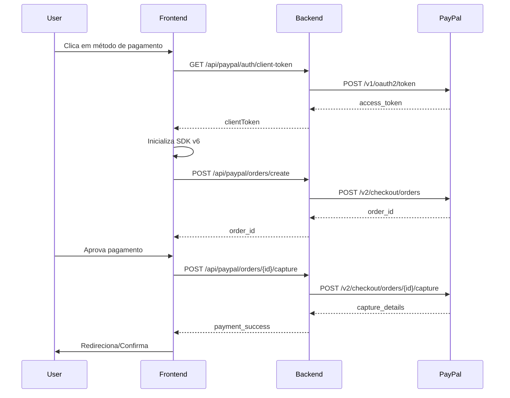

# PayPal JavaScript SDK v6 - Guia de Configuração

## 📋 Pré-requisitos

1. Conta PayPal Developer
2. Aplicação criada no [PayPal Developer Dashboard](https://developer.paypal.com/dashboard/)
3. JavaScript SDK v6 habilitado nas permissões da aplicação

## 🔑 Obter Credenciais

### 1. Acessar o Dashboard
- Visite https://developer.paypal.com/dashboard/
- Faça login com sua conta PayPal

### 2. Criar/Selecionar Aplicação
- Clique em "Apps & Credentials"
- Selecione "Sandbox" ou "Live"
- Crie uma nova aplicação ou selecione uma existente

### 3. Copiar Credenciais
- **Client ID**: Visível na página principal da aplicação
- **Secret**: Clique em "Show" para revelar

### 4. Configurar Permissões
Certifique-se de que as seguintes permissões estão habilitadas:
- ✅ Checkout
- ✅ Payments
- ✅ JavaScript SDK v6

## ⚙️ Configuração do Projeto

### 1. Adicionar ao `.env.development` ou `.env.local`

```bash
# PayPal Sandbox (Desenvolvimento)
PAYPAL_SANDBOX_CLIENT_ID=your_sandbox_client_id_here
PAYPAL_SANDBOX_CLIENT_SECRET=your_sandbox_client_secret_here

# PayPal Production (Produção)
PAYPAL_CLIENT_ID=your_production_client_id_here
PAYPAL_CLIENT_SECRET=your_production_client_secret_here
```

### 2. Reiniciar o Servidor

```bash
npm run dev
```

## 🎯 Métodos de Pagamento Suportados

A implementação suporta os seguintes métodos:

1. **PayPal** - Pagamento padrão PayPal
2. **Pay Later** - Opções de financiamento "Compre agora, pague depois"
3. **PayPal Credit** - Pagamento a crédito (específico por país)
4. **Google Pay** - Integração com carteira Google
5. **Apple Pay** - Integração com Apple Pay

### Elegibilidade Automática

O sistema verifica automaticamente quais métodos estão disponíveis baseado em:
- Localização do usuário
- Moeda selecionada
- Status da conta PayPal
- Tipo de dispositivo

## 📦 Como Usar

### Página Inicial (Assinatura)

```tsx
import PayPalV6Buttons from '@/components/paypal-v6-buttons';

<PayPalV6Buttons
  amount={29.99}
  currency="USD"
  description="Assinatura Mensal Premium"
  isSubscription={true}
  onSuccess={(data) => {
    console.log('Pagamento aprovado:', data);
    // Redirecionar para página de assinante
  }}
  onError={(error) => {
    console.error('Erro no pagamento:', error);
    // Mostrar mensagem de erro
  }}
/>
```

### Página da Loja (Produtos)

```tsx
<PayPalV6Buttons
  amount={product.price}
  currency="USD"
  description={product.name}
  isSubscription={false}
  onSuccess={(data) => {
    // Marcar produto como comprado
    // Adicionar às compras do usuário
  }}
  onError={(error) => {
    // Tratar erro
  }}
/>
```

## 🔒 Segurança

### ✅ Boas Práticas Implementadas

1. **Client Token Gerado no Servidor**
   - Token é gerado de forma segura no backend
   - Nunca expõe Client Secret no frontend

2. **Validação Server-Side**
   - Criação de pedido validada no servidor
   - Valores não podem ser manipulados no navegador

3. **Cache de Tokens**
   - Tokens são cacheados por 9 horas
   - Reduz chamadas à API do PayPal

4. **Captura Segura**
   - Captura de pagamento apenas no servidor
   - Webhook pode ser configurado para confirmação adicional

## 🧪 Testes

### Contas de Teste PayPal

Use as [contas de teste do PayPal](https://developer.paypal.com/dashboard/accounts) para simular pagamentos:

**Comprador de Teste:**
- Email: sb-buyer@business.example.com
- Senha: (definida no dashboard)

**Vendedor de Teste:**
- Email: sb-seller@business.example.com
- Senha: (definida no dashboard)

### Cartões de Teste

Para Google Pay e Apple Pay em sandbox:

**Visa:**
- Número: 4111111111111111
- CVV: 123
- Validade: Qualquer data futura

**Mastercard:**
- Número: 5555555555554444
- CVV: 123
- Validade: Qualquer data futura

## 📊 Fluxo de Pagamento



## 🚀 Produção

### Checklist

- [ ] Substituir credenciais sandbox por produção
- [ ] Atualizar URLs da API (remover `/sandbox`)
- [ ] Testar todos os métodos de pagamento
- [ ] Configurar webhooks para confirmação
- [ ] Implementar logs e monitoramento
- [ ] Testar em diferentes navegadores e dispositivos
- [ ] Verificar compliance e políticas PayPal
- [ ] Configurar fallback para erros
- [ ] Adicionar analytics e tracking
- [ ] Testar fluxo de reembolso

### Variáveis de Ambiente

```bash
# .env.production
NODE_ENV=production
PAYPAL_CLIENT_ID=your_live_client_id
PAYPAL_CLIENT_SECRET=your_live_client_secret
```

## 🆘 Suporte

- [PayPal Developer Documentation](https://developer.paypal.com/docs/)
- [PayPal Developer Community](https://developer.paypal.com/community/)
- [PayPal REST API Reference](https://developer.paypal.com/api/rest/)

## 📝 Notas

- SDK v6 usa URLs diferentes para sandbox vs produção
- Eligibility varia por região e configuração da conta
- Google Pay e Apple Pay requerem configuração adicional
- Pay Later disponibilidade depende do país do comprador
- Tokens de cliente expiram em 9 horas (32400 segundos)
